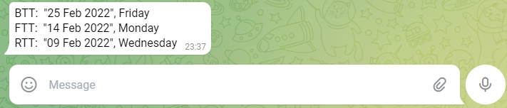

# CDCBot.py & EyesightBot.py

### CDCBot.py helps get the earliest date for Basic theory test, final theory test, and rider theory test from the CDC website.

### EyesightBot.py gets the earliest eyesight date from the CDC website.

## How to Use

1. Needs Telegram Bot Token - You can refer to this page [here](https://core.telegram.org/bots#how-do-i-create-a-bot) on how to create a bot.
   
2. Necessary Dependencies: pip install -r requirements.txt

3. Host it on Cloud and Get Updates from Telegram whenever the dates change.

Last used in 2022.